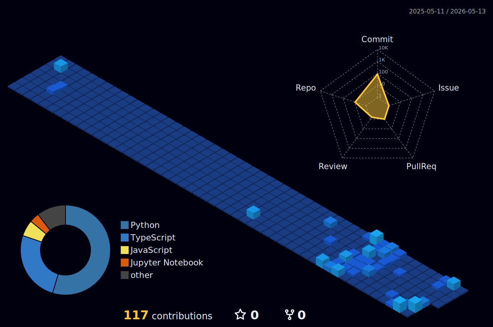

  <h1>Hi, I'm Arjun Shenoy R</h1>
  <h3>CS Engineer | AI/ML & Quantum Enthusiast</h3>
  
  

---

### What I'm Up To
- **I’m currently working on:** An ongoing research project on **Quantum ML on Galaxy Classification and Exoplanet Detection**.
- **Recent Projects:** Built **SafeHorizon**, **Project Aether**, **Sentinel Agents**, **PromptGuard**, **ZK-SWARM** and an **KYC Platform**.
- **I’m currently exploring & building with:** **TensorFlow**, **PyTorch**, **Qiskit**, **PennyLane**, **LangChain**, **Langflow**, and **Microsoft SEAL**.
- **I’m currently grinding:** Advanced problem-solving (DSA), and building scalable **Backend Architectures** and APIs using **FastAPI**, **PostgreSQL**, and **Docker**.
- **When I'm not coding:** You can find me reading novels, listening to music, or gaming.

---

### Statistical Overview

  

 

  
  

 

<!-- 

  

 -->

---

### Languages Known

  
  
  
  
  
  

### Frameworks, Tools & Databases

  
  
  
  
  
  
  
   
  
  
  
  
   
  
  
  
  
  
  

---

  
  

